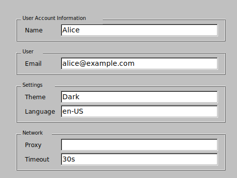

# gofltk-keyvalue

A Go widget for displaying and editing grouped key-value pairs in a grid, built on [go-fltk](https://github.com/pwiecz/go-fltk).


## Purpose

This widget allows you to easily manage and present hierarchical or grouped key-value data in graphical desktop applications. It is designed for scenarios where users need to view and modify structured configuration or settings in a clear, editable interface.

## Main API Features

- **Create and display a grid:** Instantiate a KeyValueGrid in a FLTK window at a specified position and size.
- **Add or update data:** Insert new groups and key-value pairs, or update existing ones. Groups and keys are created as needed.
- **Delete data:** Remove entire groups or individual key-value pairs from both the UI and the data model.
- **Synchronize changes:** Pull user-edited data from the UI back into the underlying GroupedKeyValueTree, ensuring your application always works with the latest values.
- **Clear all data:** Reset the grid and data model, removing all groups and entries.
- **Redraw and resize:** Refresh the grid display after changes or adapt to new window sizes for consistent layout.


## KeyValueGrid

- A FLTK-based widget for visually displaying and editing grouped key-value data.
- Owns and manages a GroupedKeyValueTree.
- Provides a dynamic grid layout where each group and its keys are clearly separated for easy editing.

### Public Functions of KeyValueGrid

- **NewKeyValueGrid**  
  Creates and initializes a new KeyValueGrid within a given FLTK parent window at the specified position and size.

- **Add**  
  Adds or updates a key-value pair in the specified group.  
  - If the group does not exist, it is created.
  - If the key does not exist in the group, it is added.
  - If the key exists, its value is updated (if a value is provided).
  - If only a group name is given, creates the group if not already present.

- **Delete**  
  Removes an entire group (if the key is empty) or a specific key within a group.  
  - Returns true if something was deleted.

- **GetData**  
  Synchronizes user-edited values from the grid UI back into the data model and returns a pointer to the root GroupedKeyValueTree.

- **ClearAll**  
  Removes all widgets and data from both the UI and the underlying data model. Resets positions and refreshes the UI.

- **Resize**  
  Updates the geometry of the grid and triggers a redraw/layout to adapt to new dimensions.

- **Refresh**  
  Rebuilds the visible grid from the current data model. Recalculates layout and redraws all widgets to fit the data.

## GroupedKeyValueTree

- The main data structure representing a collection of named groups, each containing multiple key-value pairs.
- Each group has a name and a list of elements, where each element is a key and a value.

```go
type GroupedKeyValueTree struct {
    Groups []KVPgroup
}

type KVPgroup struct {
    Name     string
    Elements []KVPelement
}

type KVPelement struct {
    Key   string
    Value string
}
```

## Example Use Cases

- Editable configuration dialogs
- User profile or settings panels
- Grouped property editors

## Example

```go
package main

import (
	fltk "github.com/archeopternix/go-fltk"
	fltk "github.com/archeopternix/gofltk-keyvalue"
)

func main() {
	fltk.InitStyles()

	win := fltk.NewWindow(500, 420)
	win.SetLabel("KeyValueGrid Demo")
	win.Resizable(win)
	win.Begin()

	// Create the KeyValueGrid (replace NewKeyValueGrid with correct import if needed)
	grid := NewKeyValueGrid(win, 20, 20, 460, 350)

	// Add some groups and key-value pairs after layout is set up
	grid.Add("User Account Information", "Name", "Alice")
	grid.Add("User", "Email", "alice@example.com")
	grid.Add("Settings", "Theme", "Dark")
	grid.Add("Settings", "Language", "en-US")
	grid.Add("Network", "Proxy", "")
	grid.Add("Network", "Timeout", "30s")

	win.End()
	win.Show()
	fltk.Run()
}
```

## License

MIT